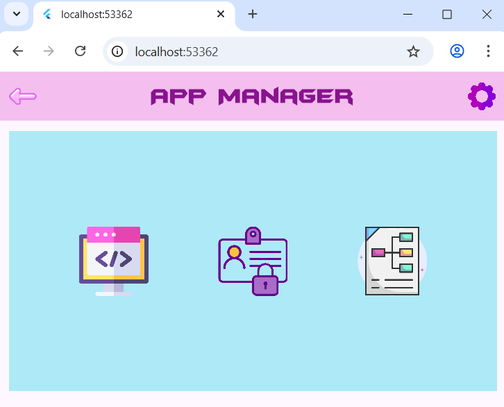

# App Manager – First Step of the Flutter Tutorial



- **Creating a new Flutter project**

- **Creating a home page:**  
  In a separate file, I created a package, used a `Scaffold`, applied styling to my widgets, integrated a font from a `.ttf` file, and added images.

- **Making an element clickable with `GestureDetector()`:**  
  Redirecting to another page using the `Navigator.push()` widget.

## Getting Started

This project is a starting point for a Flutter application.

A few resources to get you started if this is your first Flutter project:

- [Lab: Write your first Flutter app](https://docs.flutter.dev/get-started/codelab)
- [Cookbook: Useful Flutter samples](https://docs.flutter.dev/cookbook)

For help getting started with Flutter development, view the
[online documentation](https://docs.flutter.dev/), which offers tutorials,
samples, guidance on mobile development, and a full API reference.

## How to Clone the Git Repository and Run the Flutter Project

**🧩 Prerequisites**
Before starting, make sure you have:

- [Flutter](https://flutter.dev/docs/get-started/install) installed on your machine  
- [Git](https://git-scm.com/downloads) installed  
- An editor such as **VS Code** or **Android Studio**

You can check if Flutter and Git are correctly installed by running:

```bash
flutter --version
git --version 
```

Clone the project

Open your terminal and navigate to the folder where you want to store the project, then run:

```bash
git clone https://github.com/AnaisP974/app_manager.git
cd app_manager
```

Run the following command to install all necessary Flutter packages:

```bash
flutter pub get
```

Make sure you have a device connected (physical or emulator).
Then, launch the app with:

```bash
flutter run
```
